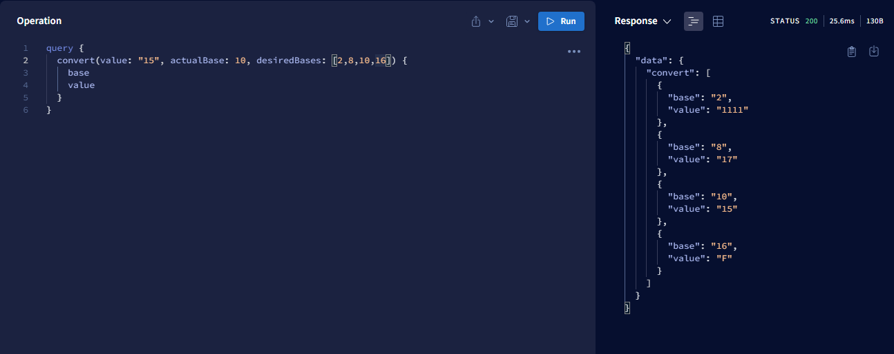

# Base-Converter-Api

Numeric base converter API using GraphQL, Apollo Server, TDD and Clean Architecture

>## Project View 

Example of how to convert 15 on base 10 to base 2, 8, 10 and 16 with a single request using Apollo Server Query Interface

> ## Principles

* Single Responsibility Principle (SRP)
* Open Closed Principle (OCP)
* Interface Segregation Principle (ISP)
* Dependency Inversion Principle (DIP)
* Separation of Concerns (SOC)
* Don't Repeat Yourself (DRY)
* You Aren't Gonna Need It (YAGNI)
* Keep It Simple, Silly (KISS)
* Composition Over Inheritance
* Small Commits


> ## Features do GraphQL

- Resolvers
- Type Definitions
- Error Handling

> ## How to use

```
  # Clone repository:
  git clone https://github.com/Mist3rBru/base-converter-api.git;

  cd base-converter-api; # Access project

  npm install; # Install dependencies

  npm run dev; # Run server


  # Access http://localhost:4000
```
